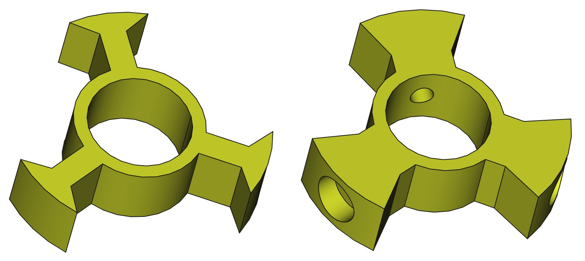

# LightPipe-Spacer

In this repo you will find different types of spacers for the [LightPipe](https://github.com/HansAchterbahn/LightPipe) project. Their purpose is to connect the center wooden rod to the acrylic glass pipe and hold it together. With a small pipe (3x16 LEDs or less), no spacer is necessary.

